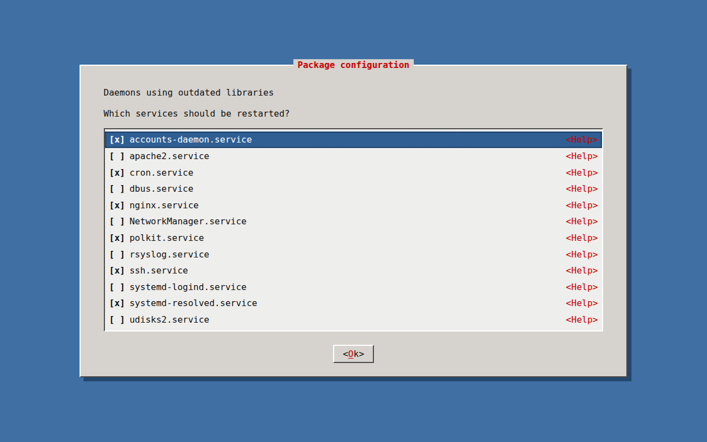
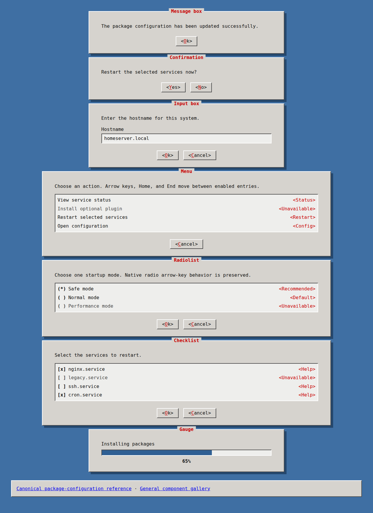

# web-tui-kit

[](https://github.com/1990jk1990/web-tui-kit/releases/latest)
[](LICENSE)
[](https://github.com/1990jk1990/web-tui-kit/actions/workflows/ai-doc-1.yml)
[](https://github.com/1990jk1990/web-tui-kit/actions/workflows/visual-regression.yml)

A reusable, framework-independent browser UI design system inspired by Debian debconf, `dialog`, and `whiptail`.

It provides a stable browser-native contract for applications that want the same text-oriented visual language on Linux desktops and Android devices without adding a JavaScript framework or runtime dependency.

**Version:** `1.0.1` (stable public contract). The canonical version is stored in `VERSION`; released versions use immutable `vMAJOR.MINOR.PATCH` Git tags.

## Preview

Canonical package-configuration composition:



Core dialog patterns:



The screenshots above are the reviewed Chromium regression baselines used by CI, not separate marketing mockups.

## Why web-tui-kit

- **Framework-independent runtime:** plain CSS and small optional JavaScript; no application build step is required.
- **Stable public contract:** tokens, classes, semantic markup relationships, data attributes, and events are explicitly inventoried and follow Semantic Versioning from 1.0 onward.
- **Maintained release process:** tagged releases are gated by structural/docs tests, deterministic artifacts, Chromium visual regression, Chromium/Firefox interaction and accessibility-semantic checks, and representative React/Vue/server-rendered recipe verification.
- **Real-device evidence:** the stable 1.0 line has a recorded physical Chrome-for-Android baseline in addition to automated narrow-touch browser coverage.
- **Open source:** distributed under the MIT License; contributions and issue reports are welcome.

The intentionally supported downstream surface is explicit in `docs/project/public-contract.md` and canonical requirements under `openspec/specs/public-contract/`. Starting with 1.0, normal Semantic Versioning applies to that declared boundary of public tokens/classes/DOM behavior rather than to incidental demo/test/internal repository details.

## Quick start

Clone the repository and serve it with any static web server:

```bash
git clone https://github.com/1990jk1990/web-tui-kit.git
cd web-tui-kit
python3 -m http.server 8000
```

Open:

- `http://localhost:8000/demo/` for the canonical package-configuration reference,
- `http://localhost:8000/demo/dialogs.html` for message, confirmation, input, menu, radiolist, checklist, and gauge patterns,
- `http://localhost:8000/demo/components.html` for the broader component gallery,
- `http://localhost:8000/examples/server-rendered/package-configuration.html` for the browser-openable template/server-rendered integration recipe.

No application build step and no JavaScript framework are required.

## Distribution and use in another project

For reproducible downstream use, pin an immutable release tag instead of copying from the moving `main` branch. For the current stable release line:

```bash
git clone --branch v1.0.1 --depth 1 https://github.com/1990jk1990/web-tui-kit.git
```

Copy or vendor the files from `src/` and include them in the consuming application:

```html
<link rel="stylesheet" href="/ui/tokens.css">
<link rel="stylesheet" href="/ui/tui.css">
<script src="/ui/tui.js" defer></script>
```

`src/tui.js` is optional when the consuming application does not need the small progressive keyboard enhancements. The exact CSS token values are defined in `src/tokens.css`; reusable component implementation lives in `src/tui.css` and `src/tui.js`.

Tagged GitHub Releases provide a focused `web-tui-kit-MAJOR.MINOR.PATCH.zip` and matching SHA-256 checksum containing the MIT license, runtime, executable demos, framework/template integration recipes, public-contract guide, version marker, changelog, security guidance, and practical design-system/AI-agent references. `v0.*` publications remain prereleases; `v1.0.0` and later stable-line tags publish normal GitHub Releases. The current distribution model does not require or publish an npm package; direct tagged vendoring remains the primary path.

For the closest match to the original Debian/Ubuntu package-configuration look, start from `.tui-screen`, `.tui-dialog`, `.tui-dialog-title`, `.tui-checklist`, `.tui-check-row`, `.tui-actions`, and `.tui-button` as demonstrated in `demo/index.html`.

For common dialog compositions, use `demo/dialogs.html` and `DESIGN_SYSTEM.md` rather than inventing per-application variants. Containers marked with `data-tui-list` gain optional ArrowUp/ArrowDown/Home/End focus navigation while normal Tab reachability and native control activation remain intact.

Canonical examples retain native semantic HTML. `.tui-dialog` is a presentation class rather than an automatic modal role, and purely visual helper hints are excluded from control accessible names where they do not convey operation-critical meaning.

Before depending on a token, class, state hook, data attribute, or event as a long-lived application interface, check `docs/project/public-contract.md`. Exact demo IDs/text/order, test harnesses, CI details, generated artifacts, and implementation-local helper names are not downstream APIs merely because they are visible in the repository.

Starting with 1.0, PATCH releases preserve the declared public contract, MINOR releases may add compatible surface or deprecate existing surface, and incompatible public-contract changes require a new MAJOR release. Planned removals should carry deprecation and migration guidance before later major removal except for documented urgent exceptions.

## Framework and template consumers

React, Vue, and server-rendered applications should generate the same semantic markup/classes instead of using a separate adapter runtime. Copy-ready recipes live under `examples/`, with detailed guidance in `docs/project/framework-integration.md`.

The React/Vue examples demonstrate framework-owned state and lifecycle handling while keeping native form controls. The server-rendered recipe demonstrates ordinary form submission. All three reuse the canonical `src/` assets and treat `tui:escape` as an application-owned signal.

The repository has development-only executable regression coverage for those canonical recipes: React `19.0.0`/React DOM `19.0.0`, Vue `3.5.13`/`@vue/compiler-sfc` `3.5.13`, and esbuild `0.24.2` are pinned as representative verification anchors. The recipes are compiled and smoke-tested in pinned Linux Chromium against canonical `src/` assets. This is representative evidence, not a claim that every React/Vue/tooling version is supported.

Do not copy the design tokens/component CSS into CSS-in-JS, scoped component styles, or a private theme implementation. If a reusable visual change is needed, make it in the canonical design system. The Node/framework/compiler dependencies used for repository verification are not runtime dependencies and are not required by consuming applications.

See `RELEASING.md` for the versioning/release procedure and `docs/project/compatibility.md` for current compatibility evidence and its limits. Physical Android evidence is tracked separately through `docs/project/android-device-check.md`; touch-capable Chromium emulation is not treated as physical-device certification. Automated browser accessibility semantics are likewise evidence, not screen-reader or WCAG certification.

## Maintenance

`web-tui-kit` is actively maintained by [@1990jk1990](https://github.com/1990jk1990) as the primary maintainer. Ongoing maintenance includes issue triage, pull-request review, compatibility evidence, release management, and keeping the documented public contract aligned with implementation and tests.

The current post-1.0 work is tracked in the [canonical v1.x roadmap](https://github.com/1990jk1990/web-tui-kit/issues/35). Published tags are immutable and release preparation is intentionally separated from feature/fix work so that release evidence remains auditable.

## Contributing and security

External bug reports, feature proposals, and pull requests are welcome. Start with `CONTRIBUTING.md`; the issue and pull-request templates capture the evidence needed to keep changes reviewable and compatible with the stable public contract.

For sensitive security findings, follow `SECURITY.md` and use GitHub's private security-reporting features when available rather than publishing exploit details or secrets in a normal issue.

## Project memory and canonical sources

This repository follows **AI-DOC-1 v1.3** as a repository-local project-governance convention. Everything required to understand and continue the project is kept in this repository; public contributors do not need access to a separate private documentation source.

- AI working rules: `AGENTS.md`
- release identity: `VERSION` + immutable Git tags/GitHub Releases
- release procedure: `RELEASING.md`
- project purpose and scope: `docs/project/overview.md`
- public consumer contract and stability boundary: `openspec/specs/public-contract/spec.md` + `docs/project/public-contract.md`
- compatibility evidence: `docs/project/compatibility.md`
- physical Android evidence procedure: `docs/project/android-device-check.md`
- framework integration guidance: `docs/project/framework-integration.md`
- accepted UI/release/integration/browser/accessibility-verification behavior: `openspec/specs/`
- current architecture: `docs/architecture/`
- durable decision rationale: `docs/decisions/`
- practical design-system usage guide: `DESIGN_SYSTEM.md`
- exact design-token values: `src/tokens.css`
- implementation: `src/`
- primary executable visual/semantic reference: `demo/index.html`
- core dialog gallery: `demo/dialogs.html`
- broader component gallery: `demo/components.html`
- framework/template consumption recipes: `examples/`
- framework recipe execution harness: `tests/framework/` + `scripts/framework_recipe_regression.py`
- structural regression evidence: `tests/`
- reviewed visual baselines: `tests/visual/baselines/`
- browser interaction fixture: `tests/browser/interaction.html`
- accessibility semantic runner: `scripts/accessibility_regression.py`

See `docs/index.md` for the documentation entry point.

## Prompt for ChatGPT / coding assistants

For a stable released reference, a consuming project can use:

> Use `https://github.com/1990jk1990/web-tui-kit/tree/v1.0.1` as the canonical UI design system. Read `AGENTS.md`, `VERSION`, `openspec/specs/public-contract/spec.md`, `docs/project/public-contract.md`, the other relevant OpenSpec specifications, `DESIGN_SYSTEM.md`, and `demo/index.html` before implementing UI. If the target app uses React, Vue, or server-rendered templates, also read `docs/project/framework-integration.md` and the matching example under `examples/`. Treat `demo/index.html` as the primary visual/semantic target, `demo/dialogs.html` as the core dialog catalog, and `demo/components.html` as the broader component catalog. Reuse the declared public tokens, CSS classes, semantic controls, data attributes, events, and interaction patterns instead of inventing a new visual language or framework-specific styling layer. Do not treat incidental demo/test/CI details as stable APIs. The application must remain usable in Linux desktop browsers and Android browsers.

Using an immutable release tag is preferable to pointing an automated consumer at `main`, because the visual and behavioral reference cannot change underneath that consumer.

## Verification

Run the fast repository/documentation checks with:

```bash
python -m unittest discover -s tests -v
python scripts/validate_ai_doc_1.py
pip install -r requirements-docs.txt
python scripts/sync_openspec_docs.py
mkdocs build --strict
```

Run the canonical Chromium screenshot regression suite with:

```bash
pip install -r requirements-visual.txt
python -m playwright install --with-deps chromium
python scripts/visual_regression.py
```

Run the browser interaction suite in pinned Chromium and Firefox with:

```bash
pip install -r requirements-visual.txt
python -m playwright install --with-deps chromium firefox
python scripts/interaction_regression.py
```

Run the accessibility semantics suite in the same pinned browser engines with:

```bash
pip install -r requirements-visual.txt
python -m playwright install --with-deps chromium firefox
python scripts/accessibility_regression.py
```

Run representative executable verification for the canonical React/Vue/server-rendered recipes with:

```bash
npm install --prefix tests/framework --no-package-lock --no-audit --no-fund
pip install -r requirements-visual.txt
python -m playwright install --with-deps chromium
python scripts/framework_recipe_regression.py
```

Build and verify the focused release archive with:

```bash
python scripts/build_release.py --version "v$(cat VERSION)" --check
```

The visual suite compares the canonical package and dialog demos against reviewed desktop/touch-mobile Chromium PNG baselines. The interaction suite verifies runtime keyboard/custom-event contracts in desktop Chromium and Firefox plus native tap behavior in a narrow touch-capable Chromium context. The accessibility suite verifies browser-computed roles, accessible names, label associations, native states, and progress semantics in desktop Chromium/Firefox plus representative narrow-touch package semantics. The framework recipe suite compiles and exercises the canonical example sources with representative pinned development versions; it is not an exhaustive framework compatibility matrix. None of these automated checks substitutes for real screen-reader/assistive-technology, WCAG conformance, or physical Android evidence. See `docs/project/testing.md` and `docs/project/compatibility.md` for the verification/evidence boundaries.

Contribution details are in `CONTRIBUTING.md`; release-maintainer steps are in `RELEASING.md`.

## License

`web-tui-kit` is licensed under the MIT License. See `LICENSE`.
